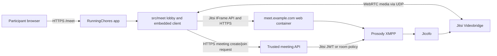

# `/meet` Self-Hosted Jitsi: Requirements and Implementation Plan

**Status:** Self-hosting plan; the RunningChores `/meet` client is implemented against the public Jitsi test service and needs configuration changes before it can use a private deployment.

## 1. Goal and System Boundaries

Keep the meeting experience inside the existing RunningChores web app at `/meet`. Users create a meeting, receive a meeting code and invite link, or enter a code to join. RunningChores embeds the Jitsi Meet interface; the Jitsi media and signaling service is operated by us on dedicated infrastructure.

This remains one frontend app: the route, lobby, invite UX, and Jitsi React SDK integration stay under `runningchores/src/meet/`, use the root React/Vite build, and ship with the existing RunningChores frontend. The Jitsi service itself is a separate server deployment with its own domain, Docker Compose stack, configuration, secrets, monitoring, and operations. It is not a second RunningChores frontend.

**Important domain constraint:** Jitsi should be hosted at a dedicated hostname such as `meet.example.com`, not under a path like `example.com/meet-service`. Jitsi's self-hosting documentation says it does not work well from a subdirectory. RunningChores remains at its `/meet` application route and embeds the Jitsi hostname in an iframe.

## 2. Recommended Deployment Shape

### Jitsi components

For the initial deployment, use the official `jitsi/docker-jitsi-meet` stable release with Docker Compose. Its standard stack contains:

- **Web:** serves the Jitsi web client and IFrame API.
- **Prosody:** XMPP signaling and conference rooms.
- **Jicofo:** conference focus/controller.
- **Jitsi Videobridge (JVB):** routes real-time audio/video media.
- **Jigasi, Jibri, transcriber:** optional components; keep them out of the initial scope unless dial-in, recording, or transcription is explicitly required.

Do not build Jitsi from source or run unstable images for the first production deployment. Pin a stable release, keep its Compose/config files in a dedicated operations repository or deployment directory (not in `src/meet/`), and test upgrades in staging.

## 3. Decisions Required Before Provisioning

| Topic | Decision/input needed | Recommended initial choice |
|---|---|---|
| Jitsi hostname | Which domain can receive DNS records and TLS? | A dedicated subdomain, e.g. `meet.<owned-domain>`. |
| Compute provider | Which provider/region has a public IPv4 address and allows UDP media traffic? | Choose after participant location and monthly budget are known; avoid assuming a generic serverless host can carry WebRTC UDP. |
| Capacity | Maximum participants in the one active meeting, expected video quality, and meeting duration? | Enforce at most one active conference; size the single JVB for the agreed maximum participants and load-test before promising capacity. |
| Network | Can inbound TCP 80/443 and UDP 10000 reach the host? Can firewall/NAT advertise the correct public IP? | These are required baseline ports for Docker Jitsi. Validate from outside the server's network. |
| TLS | Let Jitsi obtain Let's Encrypt certificates, or terminate TLS at a reverse proxy/load balancer? | Prefer the simplest supported arrangement for the chosen host. Keep HTTPS end-to-end from browsers; WebRTC getUserMedia requires a secure context. |
| Room authentication | Who may create rooms? Are guests allowed? Can any guest create another room? | Enable authenticated room creation and guest joining only after an authenticated room exists; use signed JWT admission for app-owned meetings if codes must grant access. |
| Identity source | How is a host identified and authorized? | Use a trusted identity provider/backend. Do not use RC Events demo roles, the client-supplied name, or room code as verified identity. |
| Meeting API | Where can a secure API run and hold secrets? | Use a trusted server/serverless API compatible with the chosen identity provider; it must not be implemented in browser code. |
| Meeting data | Are room records, owners, expiry, revocation, and audit needed? | Persist only what approved policies require; store opaque IDs and hashes of invite secrets rather than raw reusable secrets where feasible. |
| Reliability | Is a single-server outage acceptable? Is a second JVB/region needed? | Begin with a single node only for pilot/low-risk use; define an availability target before production claims. |
| TURN/restricted networks | Will users connect from corporate networks that block UDP? | Include TURN/TLS fallback in production network testing; decide whether to operate/configure a TURN service. |
| Backup/retention | What needs backup? | Back up configuration and required Prosody/meeting state; no recordings in initial scope. Test restore, not just backup creation. |
| Operations owner | Who patches, upgrades, monitors, responds to incidents, and pays provider bills? | Name an owner before public launch. |

### No-license-cost software list

These components are free/open-source to download and use under their respective licenses. They do not include the cost of a public VM, network bandwidth/egress, a domain, or an operator's time.

| Component | Get it from | Use in this setup | Required? |
|---|---|---|---|
| Jitsi Meet Docker Compose stack | [Official Jitsi Docker repository](https://github.com/jitsi/docker-jitsi-meet) and [stable releases](https://github.com/jitsi/docker-jitsi-meet/releases) | Runs Jitsi web, Prosody, Jicofo, and Videobridge containers. Start with the official stable release package, not the unstable branch. | Yes |
| Ubuntu Server LTS | [Ubuntu Server downloads](https://ubuntu.com/download/server) | Operating system for the Linux VM. Debian is also supported by Docker/Jitsi if preferred. | Yes, or another supported Linux distribution |
| Docker Engine and Docker Compose plugin | [Docker Engine install docs](https://docs.docker.com/engine/install/) and [Compose docs](https://docs.docker.com/compose/install/linux/) | Runs and updates the Jitsi containers. Install on the Linux VM, not as a substitute for the VM. | Yes |
| Let's Encrypt | [Let's Encrypt](https://letsencrypt.org/) | Free browser-trusted TLS certificate for `meet.<your-domain>`; Jitsi's Docker setup can automate issuance/renewal. | Yes, or another valid TLS certificate source |
| GitHub | Your existing repository/account | Keep the RunningChores app source in GitHub. Optionally keep Jitsi deployment notes and a sanitized Compose/config template in a private operations repo. Never commit `.env`, passwords, JWT keys, or private certificates. | Already available |
| Vercel | Your existing Vercel project | Continue deploying the React/Vite RunningChores frontend. An HTTP API function may coordinate meeting creation/joining if paired with durable storage. Vercel does not run the Jitsi media bridge or receive its UDP media traffic. | Already available for frontend |
| Caddy or Nginx | [Caddy](https://caddyserver.com/) / [Nginx](https://nginx.org/) | Optional reverse proxy/TLS termination only if not using Jitsi's built-in HTTPS/Let's Encrypt arrangement. Must proxy Jitsi WebSockets correctly. | Optional; omit for simplest initial install |

#### Costs that remain

- **Compute:** a VM with a stable public IP and enough CPU/RAM for the chosen maximum meeting size. Free-tier availability is provider-specific, can change, and is not a reliable production assumption.
- **Network:** public video traffic can create bandwidth/egress charges. One active meeting limits concurrent rooms, not the participant count or media bandwidth in that room.
- **Domain:** the user already has one; add a DNS record such as `meet.example.com`. A subdomain usually does not require buying another domain.
- **Optional services:** TURN relay, persistent database, backups, monitoring, or extra Jitsi bridges may have additional hosting/operational costs.

#### Suggested minimum software bundle

For the first self-hosted pilot, use Ubuntu Server LTS + Docker Engine/Compose + the official stable `docker-jitsi-meet` release + Let's Encrypt. Do not add Caddy/Nginx, PostgreSQL, Redis, Jibri, Jigasi, Kubernetes, or a monitoring suite until a requirement calls for them. The single-meeting coordinator/database is a separate app-control concern described below; it can use an existing trusted API/database or be added after the single-room access model is chosen.

### Production blockers

1. Owned hostname and public DNS control for the dedicated Jitsi domain.
2. A compute host with supported ports, public IP, and sufficient resources for expected traffic.
3. Confirmed identity and room-access policy, including whether invite code alone is acceptable.
4. A trusted server-side API and secret-management location if signed tokens, authenticated hosts, revocable invites, or secure meeting creation are required.
5. Budget, concurrency target, and named operational owner.

## 4. Access Model: Do Not Confuse Code With Authorization

The current client creates a high-entropy room code in the browser and uses it as a Jitsi room name. This is convenient for a prototype, but the code has no server record, expiry, revocation, owner, or admission policy. On an open Jitsi deployment, a room name is not proof that a participant is entitled to join.

For self-hosted production, choose a deliberate model:

### Recommended: trusted API plus signed JWTs

- RunningChores calls an API to create a meeting and receive a public join code/link.
- API authenticates the host, allocates an opaque Jitsi room name, stores meeting policy, and creates a random invitation credential (or credential hash).
- Joining the app sends code/invite to the API. The API validates meeting state, expiry, capacity, and participant policy, then issues a short-lived Jitsi JWT for the exact room and appropriate role.
- Enforce the **one-active-meeting** rule in this API/database transaction: atomically claim the sole active-meeting slot before creating a room; reject a second create request while the slot is occupied. Do not enforce this with a frontend button/state flag because another browser can bypass it and two simultaneous requests can race.
- Release the slot when the Jitsi conference is confirmed ended. Plan a server-side room-ended event/hook or reconciliation job plus an expiry/recovery policy so a browser closing unexpectedly does not leave the slot stuck forever. A host clicking “leave” alone is not a reliable server signal.
- Configure Jitsi `AUTH_TYPE=jwt`, `ENABLE_AUTH=1`, and `ENABLE_GUESTS=1` only with the desired guest behavior verified. Jitsi's guest mode can allow anonymous participants into rooms once an authenticated user has created the room; validate that behavior against the host/guest requirements.
- Vercel Functions can be considered for short HTTP create/join/token requests, not for the always-on Jitsi containers or UDP media. The active-meeting lock must use durable, atomic shared storage; process memory or a Vercel function instance is not sufficient. Check the current Vercel plan and storage quotas before relying on any free allowance.
- Keep JWT signing keys in backend secret storage. Never expose them in `VITE_*`, browser source, query strings, room names, or logs.

### Simpler alternative: private host accounts plus Jitsi lobby

Use Jitsi internal authentication or the selected supported auth integration for hosts, with guest access and the Jitsi lobby configured. This can be suitable if a logged-in host is present to create/admit participants. It does not by itself implement RunningChores meeting-code expiry/revocation; decide whether those semantics are needed.

### Insecure prototype behavior to avoid in production

- Do not switch only `domain="meet.jit.si"` to the new host and assume rooms are private.
- Do not permit anonymous room creation if unwanted rooms or abuse are concerns.
- Do not treat a display name or a random room slug as verified identity or access control.
- Do not expose Prosody/Jitsi admin credentials or JWT secrets to the React app.

## 5. Infrastructure Requirements and Deployment

### Host and DNS

- Provision a Linux VM/host appropriate for the expected load; use current Jitsi sizing guidance and load tests rather than a fixed promise in this plan.
- Reserve a stable public IP and set DNS `A` (and `AAAA` only if IPv6 routing/firewall is correct) for the Jitsi hostname.
- Configure the host firewall and provider security group for at least:
  - TCP `80` for HTTP/redirect and certificate workflows.
  - TCP `443` for HTTPS web/API/WebSocket signaling.
  - UDP `10000` for Jitsi Videobridge RTP media.
- Add any TURN ports and Jigasi ports only if those optional services are selected. Do not expose internal Prosody or Jicofo ports publicly.
- If the host is behind NAT, configure `JVB_ADVERTISE_IPS` with the public routable address (and internal address if split-horizon clients require it). Incorrect advertised IP configuration is a common cause of failed multi-party media.

### TLS and reverse proxy

- Set Jitsi `PUBLIC_URL` to the externally reachable HTTPS Jitsi hostname.
- Use the Docker stack's Let's Encrypt support or a properly configured reverse proxy/load balancer with a valid certificate.
- If TLS terminates at a reverse proxy, follow Jitsi's proxy setup: preserve WebSocket upgrade forwarding for `/xmpp-websocket`; proxy regular web requests to the Jitsi web service; bind the web container to loopback/internal networking rather than exposing it directly.
- Do not place Jitsi behind a subdirectory URL. The app's `/meet` route embeds `https://meet.<domain>` as a separate origin.
- Confirm iframe/content-security settings and browser camera/microphone permissions for the RunningChores origin and Jitsi origin.

### Docker deployment sequence

1. Provision the host, stable IP, DNS, firewall, OS patching, time sync, and monitoring.
2. Download an official stable `docker-jitsi-meet` release archive; use its documented Compose files and `env.example`.
3. Copy and edit `.env`: set `PUBLIC_URL`, `TZ`, `CONFIG`, ports, public IP settings, TLS mode, and authentication/guest policy.
4. Generate strong unique internal passwords with the official `gen-passwords.sh`; store deployment secrets in protected server-side secret storage and backups.
5. Create the required config/storage/tmp directories following the release's rootless container instructions; verify writable directories are owned/accessible as UID/GID 1000.
6. Start the standard stack with `docker compose up -d`; do not include Jibri/Jigasi/transcriber Compose overlays unless approved.
7. Verify container health/logs, TLS certificate, browser prejoin, single-room two-party audio/video, and connectivity from multiple external networks.
8. Enable authenticated room creation/lobby/JWT policy only after its behavior is tested with host and guest identities.
9. Document stable release pin, environment values (not secret values), upgrade and rollback commands, backup/restore process, and incident procedures.

## 6. RunningChores Changes Required

The existing RunningChores `/meet` route and join-code UI remain. The primary client change is to stop using the public host and use a deployment-configured self-hosted Jitsi domain.

- Add a non-secret frontend setting such as `VITE_JITSI_DOMAIN=meet.example.com` (hostname only, without scheme/path) and pass it to the SDK's `domain` prop; provide a local/dev value and fail clearly if missing. This is configuration, not a signing secret.
- Keep the existing room-name prefix/code format consistent across create and join clients so independently opened invite links resolve to the same Jitsi room.
- Keep invite URLs at the RunningChores origin (`/meet?code=...`); do not put the Jitsi server API key or a privileged JWT in the invite URL.
- For production authorization, add a separate trusted API integration under `src/meet/` (client only) and a server-side token/meeting service in the selected backend deployment. The client should request connection details; it must never sign tokens.
- Decide whether create/join requests need persistent meeting records. If so, the API—not client state—owns room creation, host identity, expiry, invite validation, and revocation.
- Test CSP/frame policies on both domains and ensure browser camera/microphone permissions work in the embedded cross-origin frame.
- Existing Vercel SPA rewrite should continue to serve `/meet` frontend routes. If API endpoints use the same Vercel project, add specific API routes before the catch-all; otherwise point the client to the approved API origin. Do not route media UDP through Vercel or an HTTP reverse proxy.

## 7. Phased Implementation Plan

### Phase 0: Confirm requirements and operational ownership

- Complete Section 3 decisions with product, infrastructure, security, and operations owners.
- Select region/provider, hostname, initial concurrency/duration target, estimated budget, and service availability target.
- Select access model: trusted API/JWT (recommended for real invite-code authorization) or authenticated host plus lobby.
- Confirm guest policy, room expiration, invite revocation, retention, abuse reporting, browser matrix, and incident owner.
- **Exit gate:** hostname, ownership, network feasibility, access model, and budget are approved.

### Phase 1: Provision and secure a staging Jitsi instance

- Create a non-production VM/host, DNS record, public IP, TLS, firewall, and alerting.
- Deploy pinned official Docker Compose release and generate unique internal credentials.
- Configure `PUBLIC_URL`, advertised JVB IP, certificate handling, and required firewall ports.
- Keep recording/transcription/dial-in components disabled.
- Verify health, logs, HTTPS/WSS, camera/microphone permissions, and two-party media from outside the hosting network.
- Test from a network that blocks UDP; measure whether TURN/TLS fallback is necessary.
- **Exit gate:** staging supports reliable two-party and multi-party test calls on the supported browser matrix and no unintended public admin/internal ports are reachable.

### Phase 2: Configure Jitsi authentication and meeting policy

- Configure the selected Jitsi auth method: JWT for app-issued scoped access, or internal auth for host users plus guest/lobby behavior.
- For JWT: set app ID/secret and issuer/audience policy in server-side secret configuration, implement a trusted token endpoint, bind tokens to the exact room, and use short validity windows.
- Create tests for host token, guest token, invalid signature, wrong room, expired token, anonymous room creation, moderator permissions, and lobby admission.
- Validate that a valid invite code cannot grant unintended moderator rights and that the configured guest behavior matches product expectations.
- **Exit gate:** unauthorized users cannot create rooms or bypass configured admission; the approved host/guest flow is demonstrated.

### Phase 3: Connect the RunningChores `/meet` client

- Configure the Jitsi hostname using a non-secret Vite environment setting; do not hardcode public `meet.jit.si`.
- Keep the generated code/link flow, or switch room-code allocation to the API if production requires persistence and revocation.
- Connect the join/create flow to the trusted API when required by the chosen access model; pass the returned, room-scoped JWT to the Jitsi React SDK.
- Keep join links at `/meet?code=...`; ensure code parsing/validation and share actions still work.
- Show useful error states for API unavailable, rejected invite, expired room, Jitsi host unavailable, and iframe load/connection failures.
- Preserve the public-service warning only in an explicit development configuration; production UI must correctly identify the self-hosted service and its policy.
- **Exit gate:** create, copy invite, join from a second browser, lobby/admission, leave, and rejoin all work against staging.

### Phase 4: Capacity, reliability, and security validation

- Load-test representative conference sizes and concurrent rooms; record CPU, memory, network throughput, packet loss, and user-perceived quality.
- Test UDP connectivity, NAT, asymmetric networks, TURN fallback, mobile sleep/resume, reconnect, browser permissions, and JVB advertised-IP correctness.
- Exercise service restart, host restart, certificate renewal, disk pressure, DNS failure, API failure, and room cleanup.
- Scan exposed ports; verify Docker services are patched, secrets are unique/backed up securely, internal services are not public, and logs avoid unnecessary PII.
- Test backup restoration and pinned-version rollback in staging before production upgrades.
- **Exit gate:** load test meets the agreed capacity target with operational headroom and the security/restore/rollback reviews pass.

### Phase 5: Production launch and operations

- Repeat the staging recipe on production infrastructure with protected secrets and verified DNS/TLS.
- Pilot with a capped user group; publish supported browser/network guidance and a contact path for call failures.
- Monitor service/container health, JVB participant/session metrics, connectivity failures, API/token errors, certificate expiry, host CPU/memory/network, and costs.
- Define patch cadence, stable-release upgrades, emergency rollback, backup retention, incident response, and capacity expansion process.
- Add JVB scale-out or a second region only when measurements and availability requirements justify it; understand Jitsi's multi-bridge/region architecture before adding nodes.
- **Exit gate:** owner signs off after pilot, dashboards/alerts are exercised, and support/incident process is staffed.

## 8. Acceptance Checklist

### App and invite flow

- [ ] RunningChores `/meet` route and direct refresh work; existing app routes remain unchanged.
- [ ] Create meeting generates or requests a valid unique code; invite URL is `https://<runningchores-host>/meet?code=...`.
- [ ] Another browser can open the invite, join the same room, and see/hear the host.
- [ ] Invalid, expired, revoked, or unauthorized codes are rejected by the API when production authorization is enabled.
- [ ] Client does not contain JWT signing secrets or Jitsi administration credentials.
- [ ] Jitsi embed loads from the configured self-hosted hostname, not public `meet.jit.si`.

### Jitsi deployment

- [ ] Dedicated Jitsi hostname resolves to the intended public IP and has a valid, renewable HTTPS certificate.
- [ ] Required TCP 80/443 and UDP 10000 work from outside the hosting network; optional TURN ports are verified if enabled.
- [ ] JVB advertises correct public/network addresses and multi-party calls route media successfully.
- [ ] Prosody/Jicofo/internal ports are not exposed publicly.
- [ ] Host, guest, lobby, JWT and room-creation behavior match the approved authorization policy.
- [ ] No recording/transcription/dial-in modules run unless explicitly approved.
- [ ] Monitoring, backups, restore, upgrade, rollback, incident response, and cost ownership are documented and exercised.
- [ ] Load test validates the agreed participant/concurrent-room target with headroom.

## 9. Risks and Mitigations

| Risk | Mitigation |
|---|---|
| Incorrect UDP firewall/NAT/advertised IP causes no media or broken group calls | Validate UDP 10000 and JVB advertised IP externally; use multi-network tests and inspect bridge stats/logs. |
| Meeting code is mistaken for authentication | Enforce Jitsi JWT/lobby or API authorization; treat code as an invite locator unless validated server-side. |
| Single Jitsi host becomes a single point of failure | Set an explicit pilot/production availability target; monitor and design backup/restore; add redundancy only with a tested multi-bridge plan. |
| Public service's five-minute or policy restriction is mistaken for a Jitsi product limit | Public `meet.jit.si` is only a test service; self-hosted instance has its own configured policy and capacity, subject to infrastructure sizing. |
| Weak secrets or exposed XMPP/admin ports permit abuse | Generate unique passwords, use least exposure, protect config/secret files, patch stable releases, and scan firewall exposure. |
| TLS/proxy/WebSocket misconfiguration breaks camera or signaling | Use valid TLS, test `/xmpp-websocket`, and follow the official reverse-proxy deployment recipe. |
| Host lacks resources or bandwidth for usage | Set expected capacity from load tests; alert on saturation and have a documented scale-up process. |
| TURN is omitted and restrictive networks fail | Test enterprise/mobile networks early; deploy/configure TURN/TLS if the target network matrix needs it. |
| Upgrades break config or rootless volume permissions | Pin stable releases, use documented config/storage/tmp directories with correct UID/GID permissions, test staging upgrades and rollback. |

## 10. Official References

- [Jitsi Docker self-hosting guide](https://jitsi.github.io/handbook/docs/devops-guide/devops-guide-docker/): official Docker Compose deployment, components, ports, TLS, authentication, NAT, proxying, logs, and configuration.
- [Jitsi self-hosting guide](https://jitsi.github.io/handbook/docs/devops-guide/): operating-system deployment guides and operations references.
- [Jitsi IFrame API](https://jitsi.github.io/handbook/docs/dev-guide/dev-guide-iframe/): embedding and configuring meetings.
- [Jitsi React SDK](https://jitsi.github.io/handbook/docs/dev-guide/dev-guide-react-sdk/): React `JitsiMeeting` integration.
- [Docker Jitsi Meet releases](https://github.com/jitsi/docker-jitsi-meet/releases): select stable release archives; use release instructions rather than unstable development images.

## 11. Deliverables

1. Approved infrastructure, DNS, sizing, cost, access, retention, and ownership decisions.
2. Staging and production Jitsi Docker Compose deployment with documented configuration and secrets handling.
3. Dedicated self-hosted Jitsi hostname with valid TLS, network rules, and JVB public-IP configuration.
4. Approved Jitsi host/guest authentication and lobby policy; trusted API/JWT implementation if required.
5. RunningChores `/meet` configured for the self-hosted Jitsi hostname and updated invite authorization flow if required.
6. Automated app/API tests, external-network/browser matrix results, capacity report, dashboards, backup/restore and rollback runbooks.
